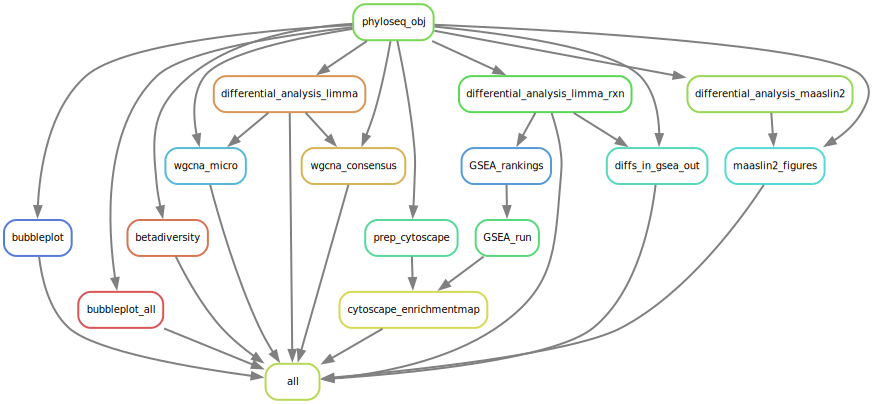

# Geneset visualisation pipeline
### Quinten Plevier, Stage TNO
##### Last update: 04-06-2024

## User input
Make a folder `data/user_input/` where you put your count data with filetype `.tsv` and your metadata with filetype `.txt`. Change the folders in `config/config.yaml` with your respective file names. Further change the config file to your liking. 

## Create conda environment
```shell
conda create -n [Name of your choice] snakemake=8.10.0
conda install graphviz # For visualisation of the DAG (see below)
```

## Activate conda and change working directory
Activate your conda environment with Snakemake and change the working directory to your directory of choice.
```shell
conda activate [Name of your snakemake conda]
cd [Path to working directory]
```

## Before running
Make sure you open the interface of Cytoscape. Otherwise, this will lead to errors in the rule `rule cytoscape_enrichmentmap`. This is done with:
```shell
Cytoscape/Cytoscape
```

## Running the snakemake
Change the `4` with the amount of cores you would like to use.
```shell
snakemake --resources cytoscape_instances=1 --use-conda -c 4
```
`--resources cytoscape_instances=1` makes sure to only run one Cytoscape rule at a time, because you can not have multiple Cytoscapes open at a time. `--use-conda` activates the .yaml conda environments for each rule. `-n` can be added to perform a dry run, to show the rules which are going to be executed.

## Creating Directed Acyclic Graphs
Visualisation of the order of the rules in the Snakemake.
```shell
snakemake --dag -c 1 | dot -Tsvg > dag.svg

# Use the command below for a simplified DAG
snakemake --rulegraph -c 1 | dot -Tsvg > rulegraph.svg
```


